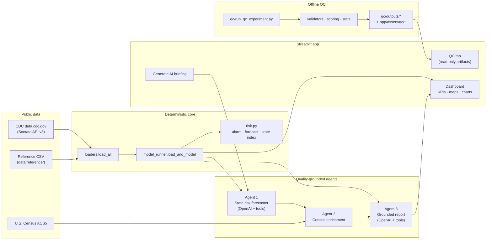
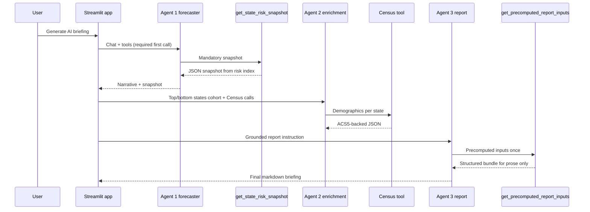
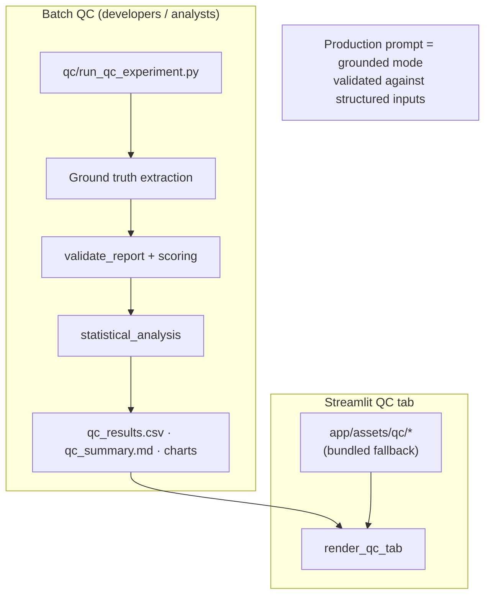

# VaxFax / ToolV2 — Measles Outbreak Risk & AI Briefings

This repository delivers **predictive surveillance software** that combines **official CDC-sourced data**, **transparent statistical models**, and **quality-controlled AI agents**. The goal is not to replace epidemiologic judgment—it is to give **public health officials**, **epidemiologists**, and **data scientists** a shared, timely picture of where measles risk is concentrated so jurisdictions can prioritize **targeted preventive measures** (vaccination outreach, lab surge, communications, and wastewater monitoring).

---

## Why this exists 

Measles moves along travel and undervaccinated corridors before it fully registers in case counts. Wastewater and coverage signals can surface pressure **before** outbreak thresholds are crossed nationally. This application wraps those signals in:

1. **A dashboard** that estimates national alarm probability, baseline burden, short-horizon case projections, and a **per-state composite risk index**—so decision-makers see *where* to look, not just *whether* the country is “busy.”
2. **AI agents** that narrate the same structured outputs **only after** mandatory tool calls attach model-backed snapshots (so prose is grounded in computed indices, not free speculation).
3. **Quality control (QC)** that scores AI-written briefings against the structured truth the model was given—demonstrating that the **production (“grounded”) prompting** materially improves validity versus looser baselines.

Together, these layers support **early, geographically targeted prevention** rather than one-size-fits-all alerts.

---

## Stakeholders & app features

The same build serves different roles; here is **who uses what** in the UI and why it matters.

- **Public health officials & program leads** — **National Risk Overview** is the day-to-day screen: **Outbreak alarm**, **Highest risk state**, **Latest case count**, the **interactive state risk map**, and **Refresh data** in the sidebar (with a **data-as-of** caption). **Generate AI briefing** produces state-level cards, watchlists, and an expandable **full markdown report** grounded via tools—not free-form guesses. **Download summary CSV** (under *Baseline risk & model detail*) exports headline metrics for situational reports. **AI Quality Control** shows pass rates and validity evidence so leadership can defend rigor to partners or oversight.

- **Epidemiologists** — **Data & Analysis** is where **historical trends**, **NNDSS vs wastewater** charts, and **kindergarten coverage** (map + sortable table, plus school-year filters where data allow) support signal triangulation. On Overview, the **Baseline risk & model detail** expander documents **what** is in the alarm model (lags, seasonality, lookahead framing). AI prose is optional icing; scores come from **`risk.py`** and agent tools call the same **state risk snapshot** the dashboard uses.

- **Data scientists & engineers** — The app is a thin layer on **`load_and_model`**: you can mirror runs with **`scripts/run_measles_multi_agent.py`** and **`scripts/run_state_risk_agent_demo.py`**, refresh QC with **`qc/run_qc_experiment.py`**, and point the **QC tab** at fresh **`qc/outputs/`** (or rely on **bundled** `app/assets/qc/` in a clean clone). OpenAI **required tool** behavior and QC **validators** are the integration surface for tests and review.

A tab-by-tab summary follows.

---

## What you get in the application

The Streamlit app (`app/main.py`) is organized into three tabs:

| Tab | Purpose |
|-----|---------|
| **National Risk Overview** | KPI cards, Plotly **state risk map** (optionally enriched from the agent cohort), optional **AI briefing** (multi-agent pipeline), expander for the **full markdown report**. |
| **Data & Analysis** | Deeper cuts: historical context, NNDSS vs wastewater visuals, kindergarten coverage map/table—supporting analytic review. |
| **AI Quality Control** | Read-only view of QC artifacts: summary narrative, validity distributions, failure-mode breakdowns, optional live-validation diagnostics—**no** batch QC execution inside the UI. |

**AI briefing** requires **`OPENAI_API_KEY`** in `.env`. Live CDC pulls require **`SOCRATA_APP_TOKEN`**. Without a Socrata token, loaders may fail or return empty frames depending on caching and local data; see [Environment variables](#environment-variables).

---

## How the pieces fit together

### End-to-end system view



### Multi-agent briefing pipeline



### QC: offline experiments vs in-dashboard transparency



---

## APIs and external services

| Service | How it is used | Configuration |
|--------|----------------|----------------|
| **CDC Open Data (Socrata) API v3** | `POST https://data.cdc.gov/api/v3/views/{view_id}/query.json` with JSON body (`query`, paging). Fetches **kindergarten MMR coverage** (`ijqb-a7ye`), **wastewater measles** (`akvg-8vrb`), and **NNDSS-style weekly measles case lines** (`x9gk-5huc`). Uses **`X-App-Token`** header. | Set **`SOCRATA_APP_TOKEN`** in `.env` (project root or `app/.env`). Without it, live fetches are skipped or fail; reference CSV still loads. |
| **OpenAI Chat Completions** | Agents use **`openai`** with **function calling**: Agent 1 **requires** `get_state_risk_snapshot` on the first turn (`tool_choice="required"`). Agent 3 uses **`get_precomputed_report_inputs`** so the final narrative is tied to precomputed JSON. QC experiments may call models for writers/graders. | **`OPENAI_API_KEY`** (required for briefing & QC). Optional **`OPENAI_MODEL`** (defaults e.g. to `gpt-5.4-mini` in agent modules). |
| **U.S. Census Bureau ACS5** | `GET https://api.census.gov/data/2023/acs/acs5` with variables B19013_001E, B01003_001E, B02001_002E for **state-level** median income, population, and race breakdown used for enrichment context. Implemented in `agents/tools/census_acs.py`. | Typically **no API key** for moderate automated use; respect Census [fair use](https://www.census.gov/data/developers/guidance.html). |

**Libraries (not remote APIs but core stack):** **Streamlit** for the UI, **Plotly** for interactive charts and maps, **pandas / numpy / scikit-learn** for data and modeling, **requests** / **httpx** for HTTP, **python-dotenv** for configuration.

---

## How to run

### Prerequisites

- **Python 3.10+** (see `requirements.txt`; project manifest may list a newer interpreter—match your environment to pinned deps).
- Network access for CDC Socrata, OpenAI, and Census.

### Setup

```bash
cd /path/to/ToolV2
python -m venv .venv
source .venv/bin/activate   # Windows: .venv\Scripts\activate
pip install -r requirements.txt
```

### Environment variables

Create a **`.env`** file in the **repository root** and/or **`app/.env`** (the app loads both; `app/.env` overrides for keys like `OPENAI_API_KEY`).

| Variable | Required for | Purpose |
|----------|----------------|---------|
| `SOCRATA_APP_TOKEN` | Live CDC datasets | Socrata application token for `data.cdc.gov` queries. |
| `OPENAI_API_KEY` | AI briefing & QC runs | OpenAI API access for agents. |
| `OPENAI_MODEL` | Optional | Override default model id for agents. |

### Launch the dashboard

```bash
streamlit run app/main.py
```

Open the URL Streamlit prints (usually `http://localhost:8501`). Use **Refresh data** in the sidebar to bypass the in-memory cache and refetch from CDC (subject to token and network).

### Run the multi-agent pipeline from the CLI

```bash
# Tool schemas only — no network
python scripts/run_measles_multi_agent.py --dry-run

# Full pipeline — needs OPENAI_API_KEY and successful data load
python scripts/run_measles_multi_agent.py
```

### Run QC experiments (offline)

From the project root (see `qc/README.md` for options):

```bash
python qc/run_qc_experiment.py --n-trials 50 --mode compare --with-grader
```

Outputs land in **`qc/outputs/`** (often git-ignored); regenerate documentation charts with `python qc/generate_documentation_charts.py` if needed. The Streamlit **AI Quality Control** tab automatically prefers fresh `qc/outputs/` files when present.

### Optional: state-risk agent demo

```bash
python scripts/run_state_risk_agent_demo.py --snapshot-only
python scripts/run_state_risk_agent_demo.py
```

---

## Repository layout (high level)

| Path | Role |
|------|------|
| `app/` | Streamlit entry (`main.py`), **`model_runner`**, **`loaders`**, **`risk`**, **`qc_panel`**, Plotly components. |
| `agents/` | **`state_risk_agent`**, **`report_writer_agent`** (multi-agent orchestration), **`enrichment_agent`**, **`tools/`** (state snapshot, Census, report context). |
| `qc/` | **`run_qc_experiment`**, **`validators`**, **`scoring`**, **`statistical_analysis`**, **`report_generation`**, prompts under `qc/prompts/`. |
| `data/reference/` | Checked-in reference series (e.g. historical measles CSV). |
| `scripts/` | CLI runners for agents and diagnostics. |
| `docs/` | Deeper technical notes (inventory, agent integration, QC methodology). |
| `qc/outputs/` | Generated QC artifacts (contents often ignored—folder retained). |
| `app/assets/qc/` | Bundled QC snapshots so the dashboard QC tab works out of the box. |

---

## Important limitations

- Outputs are **situational awareness** and **surveillance support**: they are **not** clinical guidance, guaranteed outbreak timing, or substitutes for jurisdictional case investigation.
- Models depend on **input completeness** (e.g. wastewater not available everywhere). The UI and agents surface **data gaps** where possible.
- AI text is **QC-scored against structured inputs**, not against ground-truth future disease incidence—always triangulate with local lab and immunization data.

---

## Further reading

- `qc/README.md` — plain-language tour of the QC experiment and glossary.
- `docs/agents_integration.md` — wiring notes for the state-risk agent and tool contract.
- `docs/qc_validation_methodology.md` — scoring dimensions and statistical outputs.
