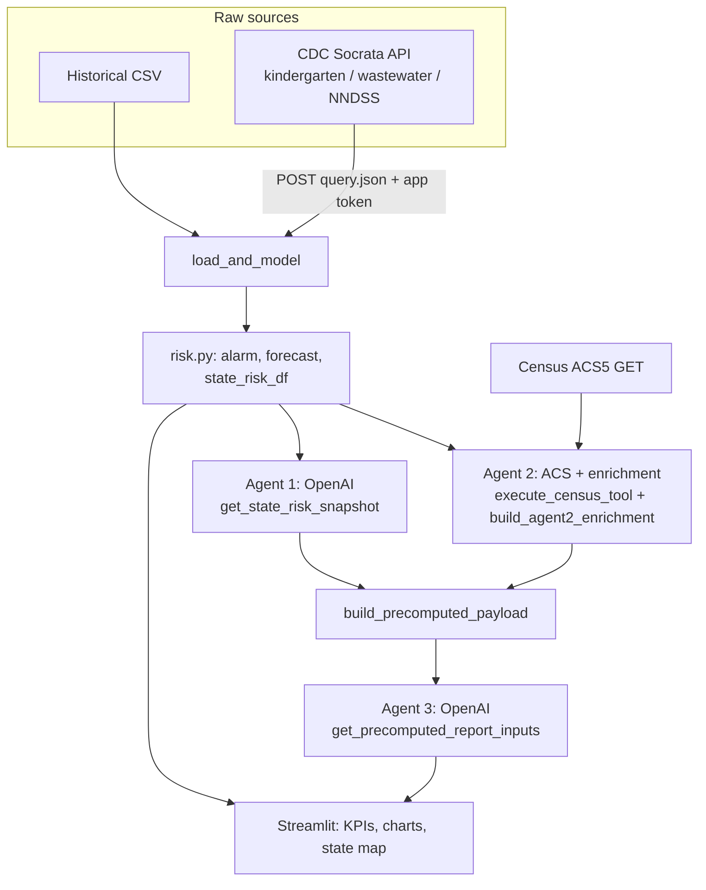

# Technical documentation — Measles risk dashboard (`dashboard_v3`)

## 1. System architecture

### 1.1 Agents (conceptual roles)

| Agent | Role | Primary inputs | Primary outputs |
|--------|------|----------------|-----------------|
| **Agent 1 — State risk forecaster** | Grounded narrative on state-level risk using the same surveillance index as the dashboard. | `kg`, `nndss`, `ww` DataFrames; optional `data_as_of`. | Short assistant text; **`last_snapshot`** from mandatory tool `get_state_risk_snapshot` (ranked `states_top`, tier counts, optional `states_full`, disclaimer). |
| **Agent 2 — Enrichment layer** | Adds **context only**: Census-linked population, per-capita case rate vs national, driver labels, and confidence — **without changing** `total_risk` / tier from `risk.py`. | `state_risk_df` from `load_and_model`; ACS demographics keyed by state; top/bottom state cohorts (default *n* = 5 each). | `top_states_enriched`, `bottom_states_enriched`, `summary_stats` (e.g. national average `cases_per_100k`, cohort medians). |
| **Agent 3 — Report generator** | Turns the **precomputed** structured bundle into a markdown briefing constrained to tool-grounded numbers. | Single JSON payload from `build_precomputed_payload` (national metrics + Agent 1 summary + Agent 2 block). | Markdown report (`assistant_text`). |

**Implementation note:** Agent 1 and Agent 3 use **OpenAI Chat Completions** with **required first-turn tool calls**. Agent 2’s logic runs in Python: it calls `execute_census_tool` → `fetch_demographics_for_states` (Census ACS5 HTTP), then `build_agent2_enrichment` — there is no separate LLM for Agent 2.

### 1.2 End-to-end workflow

1. **Data ingestion** — `load_all()` / `load_and_model()`: historical CSV (national annual); CDC **Socrata** datasets for kindergarten MMR (`ijqb-a7ye`), wastewater measles (`akvg-8vrb`), NNDSS measles (`x9gk-5huc`). Token: `SOCRATA_APP_TOKEN`.
2. **Risk scoring (unchanged core)** — `risk.py`: Stage-1 logistic alarm (national, 4-week horizon features); baseline tier; `get_state_risk_df` composite index (coverage + cases + wastewater components); forecast helper where data allow.
3. **Enrichment** — For states in top/bottom cohorts: merge ACS population → **`cases_per_100k`**; compare to cohort/national averages → **`delta_vs_national`**; label dominant signal from existing point columns → **`signal_dominance`**; completeness + wastewater presence → **`confidence_score`** / **`confidence_label`**. These fields **annotate** the risk table; they **do not** re-fit or alter the composite risk model.
4. **Report generation** — `build_precomputed_payload` assembles national + Agent 1 snapshot summary + Agent 2 JSON + fixed disclaimer text. Agent 3 must call `get_precomputed_report_inputs` (returns that payload) before emitting narrative.
5. **Dashboard rendering** — **Streamlit** (`app.py`): KPIs, Plotly charts/maps, optional **“Generate AI briefing”** button running `run_measles_multi_agent_pipeline`.

### 1.3 Data flow: computed vs displayed

- **Computed in `risk.py` / `model_runner`:** Alarm probability, baseline, forecast DataFrame, `state_risk_df` (tiers, points, `total_risk`).
- **Computed in Agent 1 tool (`state_risk_snapshot`):** JSON snapshot from `build_state_risk_index` — same family of scores as the dashboard index, serialized for the model.
- **Computed in Agent 2:** Census fetch; `cases_per_100k`, `delta_vs_national`, `signal_dominance`, narrative/confidence helpers — **not** inputs to Stage-1 or composite fitting.
- **Displayed:** All of the above in UI; map may consume enrichment for labels/tooltips where wired. **Census and income buckets are contextual** (explicitly excluded from risk scoring in payload text).

---

## 2. Process diagram (Mermaid)



---

## 3. Tools / API implementation (tool-grounded, not vector RAG)

There is **no embedding store or vector retrieval**. Grounding is **deterministic**: Python builds snapshots and payloads; models **must** call tools to access them.

| Name | Purpose | Inputs | Output |
|------|---------|--------|--------|
| `get_state_risk_snapshot` | Expose current state risk index as JSON for Agent 1. | `top_n` (int, optional), `include_full_table` (bool). Tool executor also receives `kg`, `nndss`, `ww`, `data_as_of`. | JSON string: `states_top`, `summary`, `wastewater_diagnostics`, etc. |
| `get_demographics_for_states` | Batch ACS5 demographics for states. | `state_codes`: list of two-letter abbreviations. | JSON map: state → `{population, median_household_income, pct_white, …}` or `null`. |
| `get_precomputed_report_inputs` | Return the full precomputed report bundle to Agent 3. | (none enforced; server injects `payload`.) | JSON string of `build_precomputed_payload` result. |

**Census (ACS):** `GET https://api.census.gov/data/2023/acs/acs5` with variables `B19013_001E`, `B01003_001E`, `B02001_002E` per state FIPS. **Not used in risk scoring** — population only enables per-capita **display** metrics.

**CDC ingestion:** `POST https://data.cdc.gov/api/v3/views/{view_id}/query.json` with `X-App-Token: SOCRATA_APP_TOKEN`. Views: kindergarten `ijqb-a7ye`, wastewater `akvg-8vrb`, NNDSS `x9gk-5huc`.

**Merge order:** Ingest → model bundle → (Agent 1 ∥ Agent 2 prep from same bundle) → single payload → Agent 3.

---

## 4. Technical details

### APIs

| API | Endpoint / pattern | Use |
|-----|---------------------|-----|
| CDC Socrata | `POST …/api/v3/views/{view_id}/query.json` | Kindergarten, wastewater, NNDSS |
| U.S. Census ACS5 | `GET …/data/2023/acs/acs5?get=…&for=state:{fips}` | Demographics for enrichment |
| OpenAI | Chat Completions (tools) | Agent 1 and Agent 3 |

### Environment variables

| Variable | Usage |
|----------|--------|
| `SOCRATA_APP_TOKEN` | Authenticates CDC `data.cdc.gov` Socrata requests. **Do not commit values.** |
| `OPENAI_API_KEY` | OpenAI API access for Agents 1 and 3. **Do not commit.** |
| `OPENAI_MODEL` | Optional override for default model id used by agents. |

### Python dependencies (excerpt)

`streamlit`, `pandas`, `numpy`, `requests`, `python-dotenv`, `plotly`, `scikit-learn`, `openai`, `httpx` (range pinned in `requirements.txt` for client compatibility).

### Repository layout (important paths)

```text
dashboard_v3/
  app.py                 # Streamlit entry, UI, multi-agent trigger
  model_runner.py        # load_and_model orchestration
  loaders.py             # CDC Socrata + historical CSV
  risk.py                # Core scoring, state index, Stage-1 model
  agents/
    measles_multi_agent.py   # Three-stage pipeline wiring
    openai_state_risk_agent.py
    state_risk_tools.py
    state_risk_snapshot.py
    census_tools.py
    census_acs.py
    report_context_tools.py
  components/            # charts, map, KPI helpers
  utils/                   # logging, state maps
  requirements.txt
```

### Deployment / run

- **Platform:** Local or hosted **Streamlit** app.
- **Run:** From `dashboard_v3`, with dependencies installed:  
  `streamlit run app.py`  
  (Working directory should be `dashboard_v3` so imports resolve.)

---

## 5. Usage instructions (grader-oriented)

- **Deployed app URL:** [Measles risk dashboard (Posit Connect Cloud)](https://019d7eb4-fcb0-5533-9416-f226bbe451c8.share.connect.posit.cloud)
- **Login:** Not required for this deployment (open access).
- **On load:** Sidebar shows data source status and “Data as of” timestamp; main area shows national KPIs (alarm, highest-risk state, latest cases), tabs (Overview / Analysis), and a state risk map.
- **AI briefing:** Click **“Generate AI briefing”** after data load. Requires `OPENAI_API_KEY`. On success, enriched top-state cards and a markdown report appear in the AI section.

**Interpreting highlights**

- **Top risk states:** Driven by the composite index in `state_risk_df` (coverage, recent cases, wastewater where available) — same family of scores as the map.
- **`cases_per_100k`:** Recent case-like signal scaled by ACS population — **context**, not a model feature for fitting.
- **`delta_vs_national`:** State `cases_per_100k` minus the national average computed over states with valid population (see `summary_stats.n_states_in_national_avg`).
- **`signal_dominance`:** Which of wastewater / case / coverage **point components** is largest for that row (descriptive label).
- **`confidence`:** Heuristic down-weighting when wastewater is missing or data are incomplete — does **not** replace the risk score.

**Actions:** Sidebar **Refresh data** bypasses cache; **Generate AI briefing** runs the multi-agent pipeline; CSV download available where the UI exposes it.
