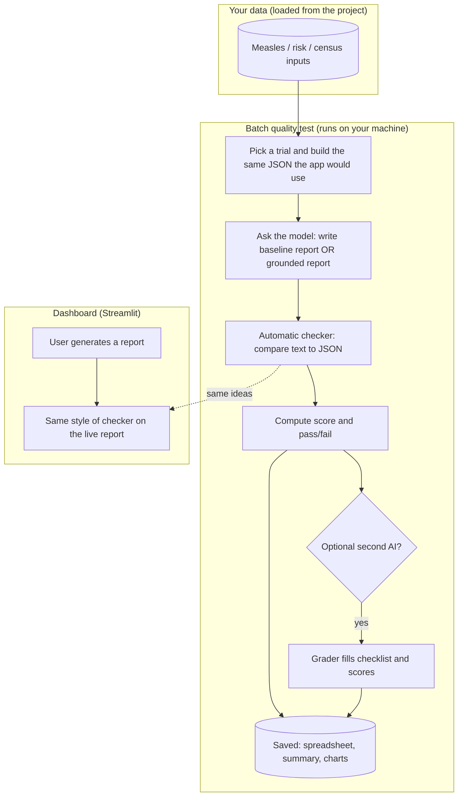
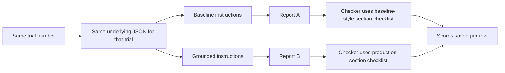
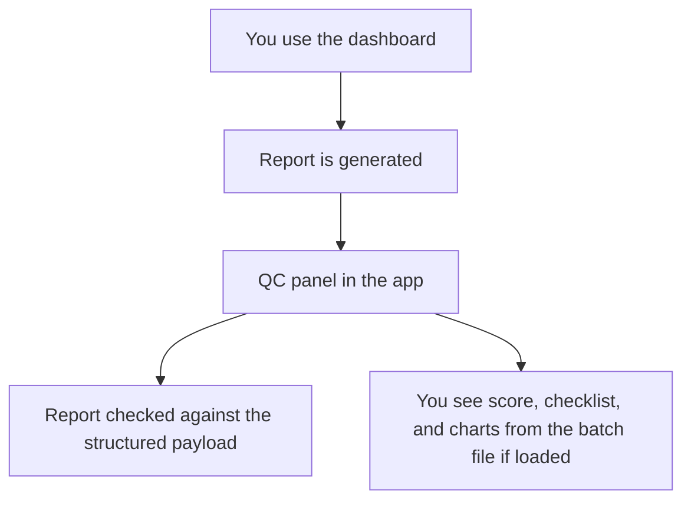

# Quality checks for measles briefings

This guide explains **how we test** the AI-written measles reports: what we compare, how we score them, what we found, and where to look if you want details. You do **not** need a statistics or engineering background to read the main sections; the **prompts** at the end are technical by nature.

**Numbers in the tables** come from the latest saved batch run (`outputs/qc_results.csv` and `outputs/qc_summary.md`). If you re-run the experiment, those files change—treat the README as a tour of the process, and the CSV/summary as the live scorecard.

---

## Who this is for

- **Program or product folks** who want the headline: did the “production” prompt actually improve reliability?
- **Anyone reviewing** charts or the short summary in `outputs/qc_summary.md`
- **Developers** who need file names and commands (still listed, but grouped toward the bottom where helpful)

---

## In plain English: what we did

We asked the same underlying data question **many times** (50 trials). For each trial we generated **two** short reports:

1. **Baseline** — an earlier, looser style of instructions for the model.  
2. **Grounded (production)** — the stricter instructions we ship today, including a fixed table for the top three states so numbers are easier to verify.

We then **checked each report against the data** the model was given (not against the real world—against the structured JSON). We computed a **quality score** (0–100) and a strict **pass/fail** that asks: “Did it hit the bar on numbers, sections, and top states?”

Optionally, a **second AI** (“grader”) reads the report and fills in a small checklist (e.g. unsupported claims, confidence wording). That adds nuance but is not as rigid as the automated checks.

**Bottom line from the last run:** the grounded, production-style prompt scored higher and passed the strict bar far more often than the baseline. The statistics section explains how we show that difference is not just luck.

---

## Glossary (quick)

| Term | Meaning |
|------|--------|
| **Baseline** | The comparison prompt (older / looser brief). |
| **Grounded (production)** | The prompt we use in production, with explicit rules and a required table for top states. |
| **Quality score (0–100)** | Weighted blend of “did the numbers and sections match the input?” Penalties apply if the checker spots invented states or numbers. |
| **Pass** | A strict rule: score at least 80 **and** meet several hard gates (e.g. all top states covered, numeric checks). You can score fairly high and still **fail** if one gate misses. |
| **Grader** | A separate model call that returns star-style sub-scores and short lists of possible issues. It’s a second opinion, not the ground truth. |

---

## Table of contents

1. [Quick actions](#quick-actions)
2. [What’s in this folder](#whats-in-this-folder)
3. [Big picture: how the pieces connect](#big-picture-how-the-pieces-connect)
4. [Batch test (offline) in one glance](#batch-test-offline-in-one-glance)
5. [Live app checks](#live-app-checks)
6. [How we check a report](#how-we-check-a-report)
7. [How the score and “pass” work](#how-the-score-and-pass-work)
8. [How we know the uplift is real](#how-we-know-the-uplift-is-real)
9. [Results from the last run](#results-from-the-last-run)
10. [What tended to go wrong](#what-tended-to-go-wrong)
11. [Checks we ran](#checks-we-ran)
12. [The grader AI (second opinion)](#the-grader-ai-second-opinion)
13. [Charts](#charts)
14. [Re-running everything](#re-running-everything)
15. [Appendix A — Baseline prompt (full text)](#appendix-a--baseline-prompt-full-text)
16. [Appendix B — Grounded prompt (full text)](#appendix-b--grounded-prompt-full-text)
17. [Appendix C — Grader prompt (full text)](#appendix-c--grader-prompt-full-text)

---

## Quick actions

| I want to… | Do this |
|------------|--------|
| Read the short written summary | Open [`outputs/qc_summary.md`](outputs/qc_summary.md) |
| See every trial in a spreadsheet | Open [`outputs/qc_results.csv`](outputs/qc_results.csv) |
| Open interactive charts | Open the `.html` files in [`outputs/qc_charts/`](outputs/qc_charts/) in your browser |
| Re-run the full comparison (needs an API key) | From the project root: `python qc/run_qc_experiment.py --n-trials 50 --mode compare --with-grader` |
| Refresh only the “summary by mode” chart | `python qc/generate_documentation_charts.py` |

---

## What’s in this folder

| What it does (plain language) | Where it lives |
|-------------------------------|----------------|
| Runs the batch test: build data, write reports, score them, optional grader, save CSV + summary + charts | [`run_qc_experiment.py`](run_qc_experiment.py) |
| Rules that compare report text to the structured input | [`validators.py`](validators.py) |
| Turns those rule outputs into the 0–100 score and pass/fail | [`scoring.py`](scoring.py) |
| Summaries, confidence intervals, and “is baseline vs grounded different?” tests | [`statistical_analysis.py`](statistical_analysis.py) |
| Writes `qc_summary.md` and the Plotly chart files | [`report_generation.py`](report_generation.py) |
| The three instruction files (writer ×2, grader ×1) | [`prompts/`](prompts/) |
| Optional: capture a live session and show that the app uses the same kind of checks as the batch job | [`live_validation_diagnostics.py`](live_validation_diagnostics.py) |
| In the app: a panel that shows scores and charts | [`../app/qc_panel.py`](../app/qc_panel.py) |
| Extra chart used in this README | [`generate_documentation_charts.py`](generate_documentation_charts.py) |

---

## Big picture: how the pieces connect



---

## Batch test (offline) in one glance



**Why pair baseline and grounded on the same trial?** So we’re not comparing “easy day” vs “hard day.” Only the instructions change; the data is identical. That makes the before/after comparison fair.

---

## Live app checks



The live checker uses the **production** section headings so it matches what the batch job does for the grounded prompt.

---

## How we check a report

1. **Build a “answer key” from the JSON**  
   We take the top three states (by risk rank), their case counts, coverage, risk labels, wastewater wording, confidence fields, and national-level context. That is the reference the report should respect.

2. **Run the automatic checker**  
   It looks for required section titles, whether the top states appear as expected, whether key numbers and labels line up, and flags patterns that look like invented states or stray numbers.

3. **Two different section checklists**  
   - **Grounded reports** must include sections like “National Overview” and “Highest Risk States” (the names the production prompt uses).  
   - **Baseline reports** are scored with a **fixed alternate checklist** so we can contrast behavior—even though the baseline *writer* instructions use slightly different heading wording. That is why baseline often scores lower on “required sections”: it’s not wrong by default, it’s measured against a different rubric for comparison.

---

## How the score and “pass” work

**Score (0–100)** — Roughly: “How well did the report track the input?” with more weight on numbers and top-state coverage, then risk/wastewater/enrichment, then confidence wording and having all sections. Invented-looking states or numbers **subtract** points (capped).

| Piece of the score (concept) | Approx. weight | In code (if you’re reading `scoring.py`) |
|------------------------------|----------------|---------------------------------------------|
| Numbers match the input | Highest | `numeric_accuracy_rate` |
| Top states covered correctly | High | `top_state_coverage_rate` |
| Risk / wastewater / extra context | Medium | `risk_match_rate`, `wastewater_match_rate`, `enrichment_usage_rate` |
| Confidence labels and caveats | Medium | `confidence_fidelity` |
| All required headings present | Medium | `required_sections_rate` |
| Brevity (if grader ran) | Small | `concision_score` from grader |

**Pass** — All of the following must be true: overall score **≥ 80**, no invented-state signal, at most one “noisy number” signal, numeric alignment at least **0.8**, and top-state coverage **100%** for the checker’s definition of “covered.”

So: **high score but fail** can happen if one of those hard gates misses (for example sections or numeric threshold).

---

## How we know the uplift is real

We don’t only eyeball averages. We also report:

| Idea | Plain-language meaning |
|------|-------------------------|
| **Confidence interval around the average score** | “If we repeated this kind of test, where might the overall average land?” |
| **Confidence interval around pass rate** | Same idea, but for the percent that **pass** under the strict rule. |
| **Paired comparison** | For the same trial, grounded vs baseline—did grounded usually win? |
| **Effect size (Cohen’s d)** | How big is the gap between the two prompts’ scores, in standardized terms? Large means a strong separation. |
| **Bootstrap interval for pass-rate difference** | “How much better is grounded on pass rate, and how uncertain is that gap?” |
| **McNemar test** | For pass/fail pairs: when the two prompts disagree, is grounded almost always the one passing? A tiny *p*-value means that pattern is very unlikely to be coincidence. |

---

## Results from the last run

Based on [`outputs/qc_summary.md`](outputs/qc_summary.md) and **50 trials × 2 prompts** = **100 rows** in [`outputs/qc_results.csv`](outputs/qc_results.csv).

### Headline

- **Grounded (production)** averaged **94.3** on the quality score and **100%** passed the strict bar (with a tight confidence interval on that pass rate).  
- **Baseline** averaged **75.2** and only **6%** passed the same strict bar.  
- When the two disagreed on pass/fail, **grounded passed and baseline failed** in **47** trials; the reverse never happened in this run. The formal paired test reports a **very small** *p*-value—consistent with a real improvement, not noise.

### Overall (all 100 rows mixed together)

| Metric | Value |
|--------|------:|
| Average quality score | **84.75** |
| 95% interval for that average | **82.70 – 86.81** |
| Share that passed strict rules | **53.0%** |

### Side-by-side: baseline vs grounded

| Prompt style | Avg quality score | Pass rate | 95% interval (pass rate) | “Invented state/number” flags (structural) |
|--------------|------------------:|----------:|----------------------------|-------------------------------------------:|
| **Baseline** | 75.18 | 6.0% | about 2% – 16% | 0% |
| **Grounded** | 94.33 | 100% | about 93% – 100% | 0% |

### How much better is grounded on pass rate?

| Question | Answer (last run) |
|----------|------------------:|
| Pass rate, baseline | 6% |
| Pass rate, grounded | 100% |
| Gap (grounded minus baseline) | **94 percentage points** |
| Uncertainty on that gap (bootstrap) | about **86 – 100** points |
| Formal paired pass/fail test (*p*-value) | **~1.4 × 10⁻¹⁴** (essentially “not random”) |
| Trials where baseline failed but grounded passed | **47** |
| Trials where baseline passed but grounded failed | **0** |

### Average scores on the same trials (paired)

| | Baseline | Grounded |
|--|----------:|----------:|
| Average quality score | 75.18 | 94.33 |

### Confidence levels in the data

In this batch, almost everything was labeled **high** confidence upstream, so we **cannot** use this run alone to judge whether the model behaves well across high vs low confidence—there wasn’t enough variety.

### Extra table (from the spreadsheet averages)

| Prompt | Avg score | Avg pass (0–1) | Avg numeric match | Avg sections found | Avg top states OK | Avg label match | Avg runtime (sec) |
|--------|----------:|---------------:|------------------:|-------------------:|------------------:|----------------:|------------------:|
| baseline | 75.18 | 0.06 | 0.61 | 0.60 | 1.00 | 1.00 | 4.98 |
| grounded | 94.33 | 1.00 | 1.00 | 1.00 | 1.00 | 1.00 | 2.28 |

---

## What tended to go wrong

These counts **overlap**—one row can hit several flags. Source: [`outputs/qc_summary.md`](outputs/qc_summary.md).

| What we flagged | How often (of 100 rows) |
|-----------------|------------------------:|
| Grader said something about **confidence misuse** | 52 |
| **Numeric** checker below 95% match | 50 |
| **Missing** some required **sections** | 50 |
| Grader listed **unsupported claims** | 50 |
| Did **not** meet the strict **pass** rule | 47 |
| Invented state / number (structural) | 0 |
| Top states not covered | 0 |
| Confidence label checks (as defined) | 0 |

**How to read this:** Many issues cluster on **baseline** rows under strict rules. Grader flags are **opinions from a model**—useful for spot review, not a legal verdict. For any row, read the actual report text and `grader_payload` in the CSV if you want context.

---

## Checks we ran

| What | Why it matters |
|------|----------------|
| Full batch pipeline (both prompts, grader, CSV, summary, charts) | End-to-end proof the tooling works and numbers are reproducible |
| Automatic statistics written into `qc_summary.md` | So the summary isn’t hand-typed each time |
| Live diagnostic script + app alignment on section names | So the **dashboard** QC matches the **batch** QC for production reports |
| Syntax / import checks during development | Avoid broken scripts before a long run |
| Documentation chart script | One place to regenerate the “summary by mode” figure |

---

## The grader AI (second opinion)

- **When:** You add `--with-grader` to the batch script. By default it runs **after** all reports are written (one batch of grader calls), which saves duplicate work versus grading after every single line.  
- **Input:** The same JSON the checker used, plus the final report text.  
- **Output:** A small JSON object: seven scores from 1–5 (facts, coverage, hallucination risk, brevity, clarity, confidence use, overall), plus three optional lists: things that look unsupported, confidence misuse notes, missing elements.  
- **How we use it:** Stored in the results file; the **brevity** score can slightly adjust the main 0–100 score. Lists feed the “what went wrong” table.  
- **Caveat:** Two automated checkers can disagree. The **first** checker (rules + data) is stricter for numbers; the **grader** is better at tone and “does this feel overstated?”

---

## Charts

The charts are **interactive web pages** (open in Chrome, Safari, Edge, etc.):

| What you’ll see | File |
|-----------------|------|
| Quality score by prompt type | [`outputs/qc_charts/validity_by_mode.html`](outputs/qc_charts/validity_by_mode.html) |
| Validity by confidence group | [`outputs/qc_charts/validity_by_confidence_group.html`](outputs/qc_charts/validity_by_confidence_group.html) |
| Confidence vs quality (scatter) | [`outputs/qc_charts/confidence_vs_validity.html`](outputs/qc_charts/confidence_vs_validity.html) |
| Several averages compared side-by-side | [`outputs/qc_charts/summary_statistics_by_mode.html`](outputs/qc_charts/summary_statistics_by_mode.html) |

There are no PNG copies in the repo by default; take a screenshot if you need a slide or PDF.

---

## Re-running everything

```bash
# From the project root — you need an OpenAI API key in the environment
export OPENAI_API_KEY=...

python qc/run_qc_experiment.py --n-trials 50 --mode compare --with-grader
python qc/generate_documentation_charts.py
```

Optional (if your paths are set up for a saved session):

```bash
python qc/live_validation_diagnostics.py
```

---

## Appendix A — Baseline prompt (full text)

Source file: [`prompts/baseline_prompt.txt`](prompts/baseline_prompt.txt)

```
Call get_precomputed_report_inputs first. Then write a markdown briefing with these sections IN ORDER:

## Executive summary
3–5 tight bullets. National alarm/baseline/forecast from payload only.

## National outlook and short-horizon forecast
Short paragraph(s). Format numbers: rates to **2 decimals**, percentages to **1 decimal**, risk scores to **1 decimal**.

## Normalized risk context
2–4 bullets comparing the **top cohort in aggregate** (not per-state cards) using **cases_per_100k**, **delta_vs_national**, and **agent2.summary_stats.national_avg_cases_per_100k**. Do **not** repeat per-state risk narratives, tiers, or scores—the dashboard UI already shows compact top-state cards. No correlation language.

## Population context (descriptive only)
At most 3 bullets using **population_bucket** only if helpful. No inference.

## Demographic note
Single sentence: "Demographic data are included for context only and are not used in risk scoring." Do not list % white or income correlations.

## Data gaps and reliability
Bullets: which states in the enriched top cohort have **data_completeness_flag** partial or **Low** confidence—keep brief, no full card-style repeats.

## Low-risk baseline states
One short paragraph describing the lowest-risk **cohort** in aggregate. Do **not** enumerate state codes. Do not restate the dashboard's short bullet summary verbatim.

## What to watch next
Exactly 3 short bullets: operational watch items only. Do not copy the dashboard's fixed bullet text word-for-word; paraphrase the same ideas (wastewater-led signals, above-national burden, low-confidence caveats).

## Limitations and disclaimer
Include payload disclaimer; keep brief.

RULES: No Pearson/correlation/% white. No duplicated stats. No raw long floats—always round as specified. No "prioritization framework" section. No "## Top states" section and no per-state card blocks.
```

---

## Appendix B — Grounded prompt (full text)

Source file: [`prompts/grounded_prompt.txt`](prompts/grounded_prompt.txt)  

When the program runs, `{structured_input_json}` is replaced by the real JSON string (see [`run_qc_experiment.py`](run_qc_experiment.py)).

```
You are producing the FINAL measles briefing. Use ONLY the provided structured input JSON.

Hard constraints:
1) Do not invent states, values, trends, or confidence labels.
2) Preserve numeric fidelity for validator fields: use the exact structured values defined below. Do not substitute model components, risk scores, points, cases per 100k, cohort averages, or other derived metrics for those fields.
3) Include the top 3 states by risk_rank from input `agent2.top_states_enriched` (or equivalent top_states list), in rank order.
4) Preserve each state's `confidence_label` exactly as in JSON (casing and wording).
5) If `confidence_score` is present for a top state, the report must contain that exact numeric value (e.g. 1.0, 0.4) so it can be matched literally.
6) Include a Limitations section.
7) If any top state has confidence_label = "low" or "moderate" (or "medium"), explicitly communicate uncertainty in Limitations.
8) Do not introduce confidence claims for states without confidence fields in the structured input.

Numeric fidelity (top 3 states only)
- **case_count** must match structured field **`cases_recent`** for that state (integer as provided). Do not replace it with risk scores, component points, cases per 100k, ranks, or any other number.
- **mmr_coverage** must match structured field **`coverage`** for that state. You may display it rounded to **one decimal** only (e.g. 90.586… → **90.6**). Do not use a different percentage or rate from the payload in its place.
- **wastewater_signal** must match structured **`signal_dominance`** or **`ww_recent`** (whichever appears for that row)—copy the string exactly (e.g. `Wastewater-driven`, `Case-driven`).
- **risk_level** in prose/table must match **`risk_tier`** or **`risk_narrative`** from structured input for that state—use the same wording.

Do not:
- Substitute derived values for case_count or mmr_coverage.
- Use percentages or rates from summary_stats, cohort medians, or other states in place of the top state's coverage or cases.
- Invent numeric values not present in the structured JSON for that field.
- If a required structured field is null or missing, write **Data not available.** for that cell (and do not invent a number).

Required compact table (MUST appear under "## Highest Risk States")
Immediately after the `## Highest Risk States` heading, include **only** an optional one-line intro (no numbers in that line), then this **markdown table** as the first structured block. Use exactly these columns and one row per top-3 state in risk_rank order:

| State | Risk level | Case count | MMR coverage (%) | Wastewater signal | Confidence label | Confidence score |
| --- | --- | ---: | ---: | --- | --- | ---: |

Rules for the table:
- **State**: two-letter code from JSON.
- **Risk level**: exact `risk_tier` or `risk_narrative` string from JSON.
- **Case count**: exact integer from **`cases_recent`** (same value the validator treats as case_count).
- **MMR coverage (%)**: value from **`coverage`**, shown with at most one decimal if rounding is needed.
- **Wastewater signal**: exact string from **`signal_dominance`** or **`ww_recent`**.
- **Confidence label**: exact `confidence_label` from JSON.
- **Confidence score**: numeric `confidence_score` from JSON, or **Data not available.** if absent.

Concision
- The table carries the exact numeric facts for the top three states; keep it to three data rows plus header.
- In **## Key Grounded Insights** and **## Conclusion**, summarize qualitatively. Do **not** add new numeric literals there except you may repeat **only** values already printed in the table above or verbatim national-level numbers you already stated in **## National Overview** from `national` / alarm fields in the JSON (do not fabricate digits).
- Avoid listing extra statistics (income %, cohort averages, other states' case rates, model point breakdowns) as numbers in those sections—they are not used for case_count/mmr_coverage matching and inflate unrelated numerals in the report.

All required section headers MUST appear exactly as written below.
Failure to include any required section is considered invalid.

## National Overview
## Highest Risk States
## Key Grounded Insights
## Limitations
## Conclusion

Write concise markdown. No extra sections.

Structured input JSON:
{structured_input_json}
```

---

## Appendix C — Grader prompt (full text)

Source file: [`prompts/grader_prompt.txt`](prompts/grader_prompt.txt)

```
You are a strict QC grader for AI-generated public health reports.
You must compare:
1) STRUCTURED_GROUND_TRUTH_JSON
2) REPORT_TEXT

Scoring rubric (1-5 each):
- factual_grounding_score: factual consistency with structured input
- input_coverage_score: whether required structured elements are covered
- hallucination_risk_score: 5 means no hallucination risk, 1 means severe hallucination
- concision_score: concise and non-redundant
- clarity_score: readable, operationally clear
- confidence_usage_score: confidence labels/scores preserved and uncertainty communicated when needed
- overall_score: overall quality given the above

You must detect:
- unsupported claims (facts not in structured input)
- confidence misuse (up/down-grading, overclaiming certainty, missing low-confidence disclosure)
- missing required elements

Return STRICT JSON only, no prose:
{
  "factual_grounding_score": 1-5,
  "input_coverage_score": 1-5,
  "hallucination_risk_score": 1-5,
  "concision_score": 1-5,
  "clarity_score": 1-5,
  "confidence_usage_score": 1-5,
  "overall_score": 1-5,
  "unsupported_claims": [],
  "confidence_misuse": [],
  "missing_required_elements": []
}
```
